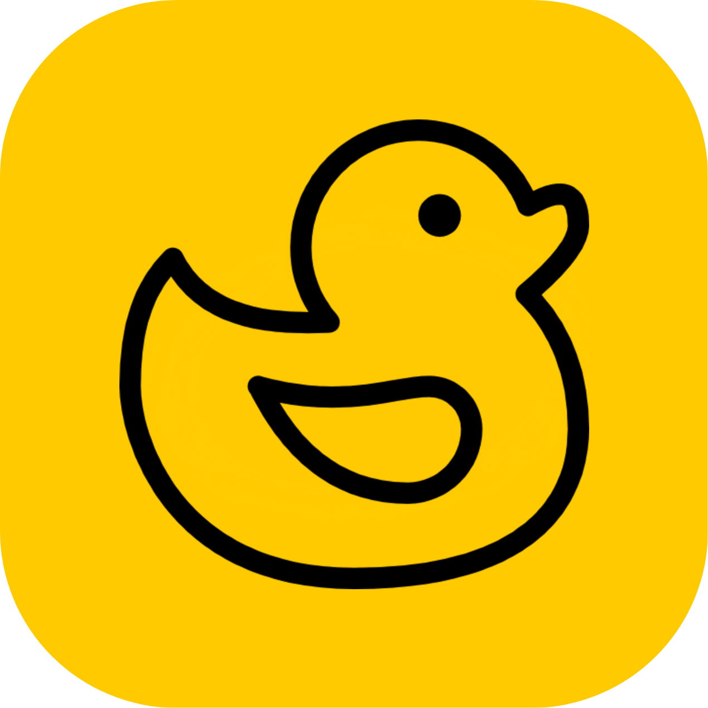

<div align="center">
  
  <h1>Ducky - The Ultimate Networking Tool</h1>
  <p>
    An open-source, all-in-one desktop application for network engineers, students, and enthusiasts.
  </p>
  
  <!-- Badges -->
  <p>
    
    
    <a href="LICENSE"></a>
    <a href="https://github.com/<Your-GitHub-Username>/Ducky_Project/issues"></a>
    <a href="https://github.com/<Your-GitHub-Username>/Ducky_Project/pulls"></a>
  </p>
</div>

---

Ducky is a powerful, Desktop application that combines several essential networking utilities into a single, intuitive graphical interface with customizable themes. Stop switching between dozens of windows and get everything you need in one place.


*(A screenshot of the Ducky application in action with the dark theme)*

##  Features

*   ** Serial Terminal**: Connect to routers, switches, and other devices with a full-featured serial terminal. Log your sessions for later review.
*   ** Session Manager**: Save and organize your terminal sessions in a hierarchical folder structure. Rename, delete, and create new folders directly from the UI.
*   ** Subnet Calculator**: Quickly calculate IPv4 and IPv6 subnets, including network addresses, usable host ranges, and broadcast addresses.
*   ** Network Monitor**: Get a quick overview of your local system's network interfaces and run essential diagnostics like `ping` and `traceroute` against any target.
*   ** Port Scanner**: Scan a target IP address for open TCP ports within a specified range.
*   ** Rich-Text Notepad**: Keep notes, code snippets, and reminders handy in a dockable widget with formatting tools and auto-save.
*   ** Customizable UI**: Switch between a sleek dark theme (default) and a clean light theme. Customize terminal colors and fonts to your liking.

##  Getting Started

Follow these instructions to get Ducky running on your local machine.

### Prerequisites

-   [Python 3.9](https://www.python.org/downloads/) or newer.
-   `pip` (Python's package installer), which is usually included with Python.

### Installation

1.  **Clone the repository:**
    Open Command Prompt or PowerShell and run:
    ```bash
    git clone https://github.com/<Your-GitHub-Username>/Ducky_Project.git
    cd Ducky_Project
    ```
    *(If you don't have git, you can download the project as a ZIP file from GitHub and extract it).*

2.  **Install the required packages:**
    It is highly recommended to use a virtual environment to keep dependencies clean.

    ```powershell
    # Create and activate a virtual environment
    python -m venv venv
    .\venv\Scripts\activate
    
    # Install dependencies from requirements.txt
    pip install -r requirements.txt
    ```

## 🏃‍♀️ How to Run

After installation, simply run the `main.py` script from the project's root directory:

```bash
python main.py
